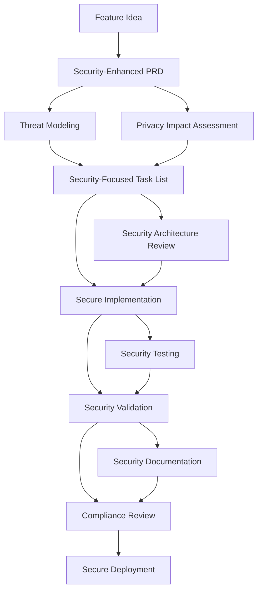

# 🔐 Security-Enhanced AI Dev Tasks for Cursor 🤖

Welcome to **Security-Enhanced AI Dev Tasks**! This enhanced workflow provides a comprehensive security-first approach to feature development within the [Cursor](https://cursor.sh/) editor. By integrating security considerations, privacy requirements, compliance validation, and risk assessment throughout the development lifecycle, you can build secure, compliant, and resilient features with AI assistance.

## 🛡️ Security-First Philosophy

Building secure software with AI requires a systematic approach that integrates security from the very beginning. This enhanced workflow ensures that:

1. **Security by Design:** Security considerations are embedded from PRD creation through deployment
2. **Comprehensive Risk Management:** Threat modeling and risk assessment guide development decisions
3. **Compliance Integration:** Regulatory and policy requirements are validated throughout the process
4. **Privacy Protection:** Privacy-by-design principles are applied consistently
5. **Operational Security:** Security monitoring, incident response, and governance are planned from the start

## 🚀 Enhanced Workflow: From Secure Idea to Secure Implementation

### Overview of Security Integration Points



### 1️⃣ Create a Security-Enhanced Product Requirement Document (PRD)

Start with a comprehensive PRD that integrates security, privacy, and compliance requirements from the beginning.

**Using the Security-Enhanced PRD Template:**

1. Ensure you have the `create-prd-secure.mdc` file accessible
2. In Cursor's Agent chat, initiate secure PRD creation:

    ```
    Use @create-prd-secure.mdc and @security-template.md
    Here's the feature I want to build: [Describe your feature in detail]
    Security context: [Describe any known security requirements, data sensitivity, compliance needs]
    Reference these files: [Optional: @file1.py @file2.ts]
    ```

**The AI will ask comprehensive security-focused questions including:**
- Data sensitivity and classification requirements
- Authentication and authorization needs
- Compliance and regulatory requirements (GDPR, HIPAA, PCI DSS, etc.)
- Privacy considerations and user consent requirements
- Threat landscape and business impact concerns
- Monitoring and incident response needs

### 2️⃣ Generate Your Security-Focused Task List

Transform your security-enhanced PRD into a detailed implementation plan with integrated security controls.

1. Ensure you have `generate-tasks-secure.mdc` accessible
2. In Cursor's Agent chat, create security-focused tasks:

    ```
    Now take @MyFeature-PRD.md and create tasks using @generate-tasks-secure.mdc with @security-template.md
    ```

**The generated task list includes:**
- **Security Planning & Threat Modeling** tasks
- **Security Architecture & Design** tasks  
- **Secure Implementation** with built-in security controls
- **Comprehensive Security Testing** (SAST, DAST, SCA)
- **Privacy & Compliance Implementation** tasks
- **Security Operations Setup** tasks
- **Security Validation & Review** checkpoints
- **Deployment Security** requirements

### 3️⃣ Security-Enhanced Task Processing

Use the enhanced task processing workflow that includes mandatory security validation at each step.

1. Ensure you have `process-task-list-secure.mdc` accessible
2. Start with the first task:

    ```
    Please start on task 1.1 and use @process-task-list-secure.mdc with @security-template.md
    ```

**Each task completion includes:**
- Implementation of required security controls
- Security testing and validation
- Documentation of security evidence
- Compliance verification (where applicable)
- Risk assessment updates
- Security review checkpoint

### 4️⃣ Security Validation and Review

**Before ANY task is marked complete, the AI must:**
- ✅ Execute comprehensive security validation
- ✅ Run required security tests (unit, integration, scanning)
- ✅ Update security documentation and threat models
- ✅ Validate compliance requirements
- ✅ Present security evidence to you for review

**You review and approve each task only after:**
- Security validation results are satisfactory
- Any security findings are addressed or accepted
- Compliance requirements are met
- Documentation is complete and accurate

## 🔐 Security Template Integration

All workflow files integrate with the comprehensive `security-template.md` which provides:

### **Security Considerations**
- Threat modeling guidelines
- Data classification and handling requirements
- Attack surface analysis

### **Security Requirements**
- Authentication & Authorization standards
- Input validation & sanitization requirements
- Data protection and encryption standards
- Communication security requirements

### **Security Architecture**
- Defense in depth principles
- Zero trust architecture guidelines
- Secure development architecture patterns

### **Risk Assessment**
- Risk identification matrices
- Business impact assessment frameworks
- Technical risk factor analysis

### **Privacy Requirements**
- Data privacy principles (GDPR compliance)
- Privacy rights implementation
- Privacy impact assessment guidelines

### **Governance, Risk & Compliance**
- Regulatory compliance checklists
- Policy alignment requirements
- Audit and documentation standards

### **Security Controls Design**
- Preventive, detective, and corrective controls
- Compensating control strategies
- Security operations integration

## 🗂️ Security-Enhanced Files

### **Core Workflow Files (Security-Enhanced)**
- **`create-prd-secure.mdc`**: Security-focused PRD generation with comprehensive threat modeling
- **`generate-tasks-secure.mdc`**: Security-integrated task list generation with mandatory security checkpoints  
- **`process-task-list-secure.mdc`**: Security validation requirements for each task completion

### **Security Foundation**
- **`security-template.md`**: Comprehensive security template covering all security domains
- **`README-Security-Enhanced.md`**: This file - complete security workflow guide

### **Example Security Artifacts Generated**
- Threat model documents
- Security architecture documentation
- Privacy impact assessments
- Compliance validation reports
- Security testing results
- Incident response procedures
- Security operations runbooks

## 🎯 Security Benefits

### **Comprehensive Security Coverage**
- **Built-in Security:** Security controls designed and implemented from the start
- **Risk Management:** Systematic threat identification and mitigation
- **Compliance Assurance:** Regulatory requirements validated throughout development
- **Privacy Protection:** Privacy-by-design principles consistently applied

### **Quality Assurance**
- **Security Testing:** Mandatory security testing at each phase (SAST, DAST, SCA)
- **Code Review:** Security-focused code review requirements
- **Documentation:** Comprehensive security documentation and evidence
- **Validation:** Multi-checkpoint security validation process

### **Operational Readiness**
- **Monitoring:** Security monitoring and alerting configured from day one
- **Incident Response:** Security incident procedures planned and documented
- **Governance:** Audit trails and compliance evidence maintained
- **Training:** Security awareness and training materials created

## 🔧 How to Use the Security-Enhanced Workflow

### **1. Preparation**
- Clone or download all security-enhanced `.mdc` files
- Review the `security-template.md` to understand security requirements
- Ensure your development environment includes security tools (SAST, DAST scanners)

### **2. Feature Development Process**
Follow the enhanced 4-step process with security validation at each stage:

1. **Secure PRD Creation** → Security requirements defined
2. **Security Task Generation** → Security controls planned  
3. **Secure Implementation** → Security controls implemented
4. **Security Validation** → Security evidence collected

### **3. Security Checkpoints**
Mandatory security reviews at these stages:
- **SR-1:** Threat Modeling Review (Before development)
- **SR-2:** Security Architecture Review (Design phase)  
- **SR-3:** Security Code Review (Implementation phase)
- **SR-4:** Security Testing Review (Pre-deployment)
- **SR-5:** Compliance Review (Pre-release)
- **SR-6:** Privacy Impact Assessment (If PII involved)

## ⚠️ Security Validation Requirements

### **Never Skip Security Validation**
Every task completion requires:
- Security controls properly implemented
- Security tests passing
- Documentation updated
- Compliance requirements met
- Risk assessments current

### **Security-First Mindset**
- Security is non-negotiable
- Validate before proceeding
- Document everything
- Communicate transparently
- Follow established standards

## 🚨 Security Risk Management

### **Risk Escalation Protocol**
If security issues are discovered:

**Critical/High Risks:** 🛑 Stop work immediately, escalate
**Medium Risks:** ⚠️ Document, implement compensating controls  
**Low Risks:** 📝 Document, plan remediation

### **Security Communication**
Each completed task includes:
- Security validation results
- Security test outcomes  
- Compliance status
- Risk level assessment
- Security evidence links

## 🎓 Security Training Integration

### **Required Security Knowledge**
Teams using this workflow should understand:
- Secure coding practices
- Common vulnerability types (OWASP Top 10)
- Authentication and authorization concepts
- Data protection principles
- Privacy regulations (GDPR, CCPA)
- Incident response basics

### **Security Tools Familiarity**
- Static Application Security Testing (SAST) tools
- Dynamic Application Security Testing (DAST) tools  
- Software Composition Analysis (SCA) tools
- Security code review techniques
- Threat modeling methodologies

## 📊 Security Metrics and KPIs

Track these security metrics throughout development:

### **Security Quality Metrics**
- Security test coverage percentage
- Security scan pass rates
- Vulnerability remediation time
- Security review completion rates

### **Compliance Metrics**  
- Compliance requirement coverage
- Privacy control implementation rate
- Audit readiness score
- Documentation completeness

### **Operational Security Metrics**
- Security monitoring coverage
- Incident response readiness
- Security training completion
- Risk assessment currency

## 🔄 Continuous Security Improvement

### **Feedback Integration**
- Security findings inform future development
- Threat model updates based on implementation learning
- Security tool effectiveness evaluation
- Process improvement based on security outcomes

### **Security Evolution**
- Regular security template updates
- New threat landscape considerations  
- Emerging compliance requirements
- Technology-specific security guidance

## 🤝 Contributing to Security Enhancement

### **Security Template Improvements**
- Submit updates to security controls
- Add new compliance requirements
- Enhance threat modeling guidance
- Improve security testing procedures

### **Workflow Enhancements**  
- Better security integration points
- Enhanced security validation procedures
- Improved security documentation templates
- More comprehensive security checklists

## 📚 Security Resources and References

### **Security Frameworks Referenced**
- NIST Cybersecurity Framework
- OWASP Application Security Verification Standard
- ISO 27001/27002 Information Security Management
- NIST Privacy Framework
- CIS Controls

### **Compliance Standards Covered**
- GDPR (General Data Protection Regulation)
- CCPA/CPRA (California Consumer Privacy Act)
- HIPAA (Health Insurance Portability and Accountability Act)
- PCI DSS (Payment Card Industry Data Security Standard)
- SOC 2 (Service Organization Control 2)

### **Security Testing Integration**
- Static Application Security Testing (SAST)
- Dynamic Application Security Testing (DAST)  
- Interactive Application Security Testing (IAST)
- Software Composition Analysis (SCA)
- Container Security Scanning

---

## 🎯 Getting Started with Security-Enhanced AI Dev Tasks

1. **Start with security awareness:** Review the security template and understand your security requirements
2. **Plan for security:** Use the security-enhanced PRD template to define comprehensive security requirements
3. **Implement with security:** Follow the security-focused task generation and processing workflows  
4. **Validate security:** Never skip security validation steps
5. **Maintain security:** Keep security documentation and controls current
6. **Improve security:** Learn from security findings and enhance your approach

**Remember:** Security is not a destination, it's a continuous journey. Every feature is an opportunity to strengthen your overall security posture.

---

**Happy secure AI-assisted developing! 🛡️** 